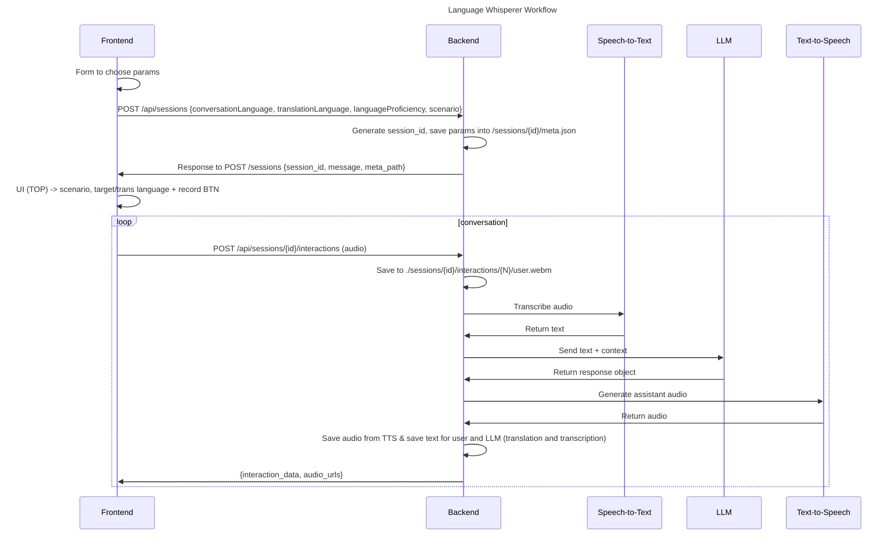

# Language whisperer project

A conversational language learning application that helps users practice speaking in their target language through AI-powered conversations. Users can set their fluency level, choose a conversation scenario, and engage in real-time voice conversations with an AI assistant. They will be also able to see a translation of what they or the bot have said in a translation language.

## Features

- **Voice-to-Voice Conversations**: Speak naturally and receive audio responses.

- **Multiple Languages**: Practice conversation in 8 different languages.

- **Adaptive Difficulty**: Set your fluency level for appropriate conversation complexity (A1-C2).

* **Scenario-Based Learning** : Choose from different conversation contexts or write your own scenario.

- **Real-time Transcription**: See what you said and what the AI responded in the original language & in the translation language.

## Installation

### Prerequisites

1. _Docker and Docker Compose installed on your system._

2. _At least 4GB of available RAM._

3. _Internet connection for initial model downloads._

### Quick Start

1. **Clone the repository**

2. **Start all services**

   ```bash
   docker compose up
   ```

3. **Wait for initialization**
   The first startup will take several minutes as it downloads the required AI models:

   - LLM model (Gemma 3 1B)
   - Whisper STT model
   - Kokoro TTS model

4. **Access the application**
   Once all the services are healthy, you can access all the services including:
   - Frontend: http://localhost:5173
   - Backend API: http://localhost:3000

### Service Health Check

You can monitor the health of all services:

```bash
docker ps -a
```

All services should show "healthy" status before using the application.

### Stopping the Application

```bash
docker compose down
```

or

```
ctrl + c
```

To remove all data and models:

```bash
docker-compose down -v
```

## Usage

1. Open http://localhost:5173 in your browser
2. Fill out the form with:
   - Conversation language (target language to practice)
   - Translation language
   - Your fluency level
   - Conversation scenario
3. Click start to begin your voice conversation
4. Use the record button to speak and receive AI responses

## Workflow



### Inspect a certain docker container

`docker inspect --format='{{json .State.Health}}' <container-name>`
